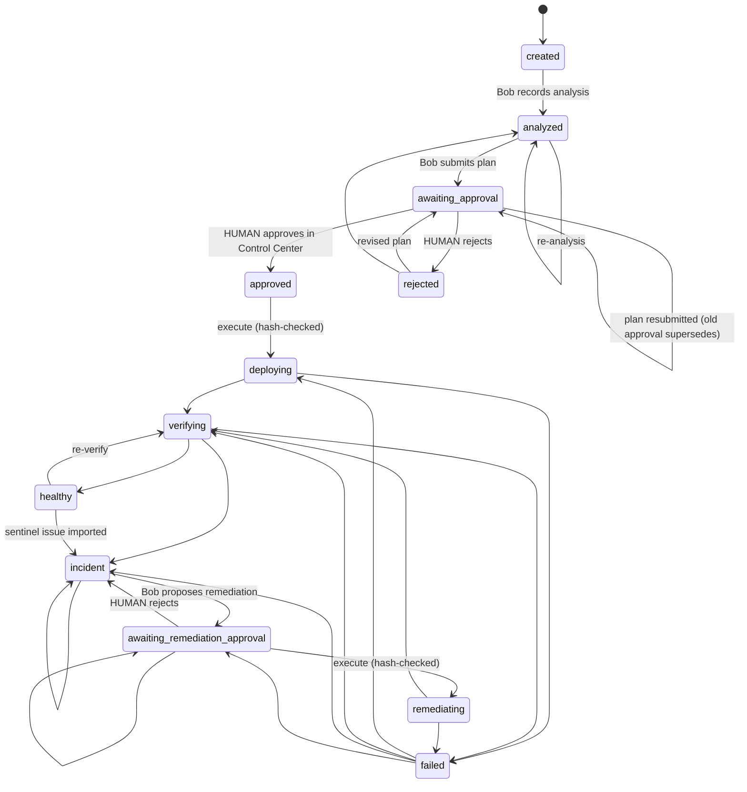
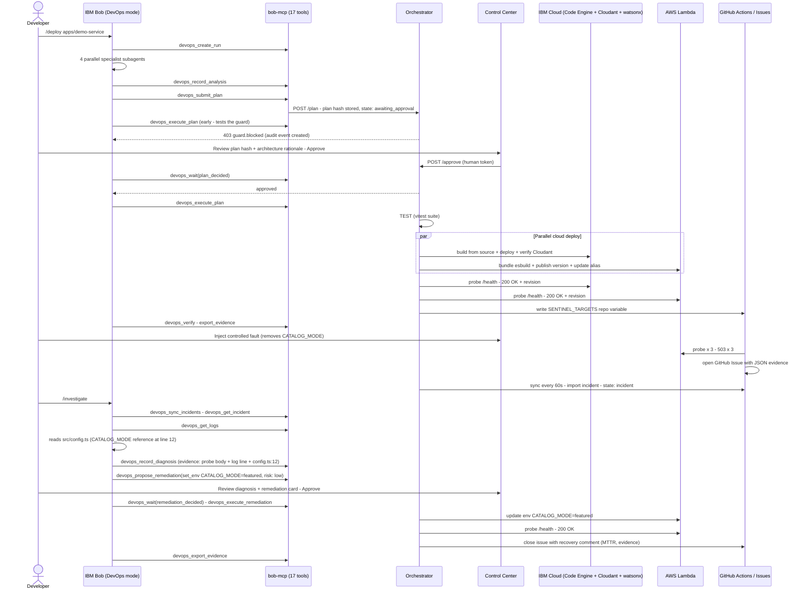

# AXIS — Agentic eXecution Infrastructure as a Service

> **IBM Bob 2.0 Hackathon Submission · September 25–27, 2026**
> *"Bob is the DevOps engineer, you are the approver, and the orchestrator is the enforcement layer."*

---

## System Architecture

```
+--------------------------------------------------------------------------------------------+
|                                                                                            |
|  DEVELOPER                                                                                 |
|  types one sentence ---------------------------------------------------------------+       |
|                                                                                    |       |
+----------------------+                                                             v       |
|  IBM BOB IDE         |                                             +-----------------------+|
|  +------------------+|                                             |  /deploy  /investigate ||
|  | Multi-Cloud      ||                                             |  Custom slash commands ||
|  | DevOps Mode      ||                                             +----------+------------+|
|  |                  ||                                                        |             |
|  | 6 rules          ||      +---------------------------------------------+  |             |
|  | 2 skills         ||      |  4 PARALLEL SPECIALIST SUBAGENTS             |  |             |
|  | evidence-first   ||      |  +------------+  +------------+              |  |             |
|  +--------+---------+|      |  | Application|  |   Cloud    |              |  |             |
|           |          |      |  | Analyst    |  |  Architect |              |  |             |
|           |          |      |  +------------+  +------------+              |  |             |
|           |          |      |  +------------+  +------------+              |  |             |
|           |          |      |  | Security   |  |  Release   |              |  |             |
|           |          |      |  | Reviewer   |  |  Verifier  |              |  |             |
|           |          |      |  +------------+  +------------+              |  |             |
|           |          |      |           v synthesize                       |  |             |
|           |          |      |   Single deployment plan + rationale         |  |             |
|           v          |      +------------------------------------------+  |  |             |
|  MCP stdio channel   |                                                 |  +--+             |
+----------------------+                                                 |                   |
                                                                         v                   |
+-----------------------------------------------------------+                                |
|  apps/bob-mcp  (MCP stdio server)                        |<-------------------------------+|
|                                                          |                                 |
|  17 lifecycle tools -- deliberately NO approve tool      |                                 |
|  devops_create_run        devops_record_analysis         |                                 |
|  devops_submit_plan       devops_execute_plan            |                                 |
|  devops_wait              devops_verify                  |                                 |
|  devops_get_incident      devops_record_diagnosis        |                                 |
|  devops_propose_remediation  devops_execute_remediation  |                                 |
|  devops_export_evidence   devops_get_logs  ...           |                                 |
|                                                          |                                 |
|  HTTP --> localhost:4000                                 |                                 |
+------------------------+---------------------------------+                                 |
                         |                                                                   |
                         v                                                                   |
+----------------------------------------------------------------------------------------+  |
|  apps/orchestrator  (Hono 4 - TypeScript ESM)                                         |  |
|                                                                                        |  |
|  +---------------------------------------------------------------------+              |  |
|  |  STATE MACHINE  (packages/core/src/state-machine.ts)                |              |  |
|  |                                                                     |              |  |
|  |  created --> analyzed --> awaiting_approval                         |              |  |
|  |                               v  HUMAN approves                     |              |  |
|  |                           approved --> deploying --> verifying      |              |  |
|  |                                                         v           |              |  |
|  |                                                     healthy <-------+              |  |
|  |                                                         v  sentinel                |  |
|  |                                                    incident                        |  |
|  |                                                         v                          |  |
|  |  awaiting_remediation_approval --> remediating --> verifying                       |  |
|  +---------------------------------------------------------------------+              |  |
|                                                                                        |  |
|  +--------------------+   +------------------+  +-----------------------------+       |  |
|  | Approval guard     |   | Evidence store   |  | SSE event stream --> UI     |       |  |
|  | SHA-256 plan hash  |   | audit trail      |  | /api/runs/:id/events        |       |  |
|  | 403 guard.blocked  |   | immutable events |  | real-time run updates       |       |  |
|  +--------------------+   +------------------+  +-----------------------------+       |  |
+----------------------------+----------------------------+-----------------------------+  |
                             |                            |                                 |
            +----------------+                            +------------------+              |
            v                                                                v              |
+---------------------------+                             +---------------------------+    |
|  IBM CLOUD                |                             |  AWS                      |    |
|                           |                             |                           |    |
|  Code Engine              |                             |  Lambda + Function URL    |    |
|  +- always-on container   |                             |  +- on-demand             |    |
|  +- scale-to-zero         |                             |  +- provisioned concur.   |    |
|                           |                             |                           |    |
|  Cloudant (NoSQL)         |                             |  CloudWatch Logs          |    |
|  +- state persistence     |                             |  versions + alias rollback|    |
|  +- audit records         |                             |                           |    |
|                           |                             |                           |    |
|  watsonx.ai WML           |                             |                           |    |
|  +- IBM Granite 3-8B      |                             |                           |    |
|     Watson Agent Q&A      |                             |                           |    |
+---------------------------+                             +---------------------------+    |
            ^                                                                ^              |
            |                                                                |              |
            +----------------------------------+-----------------------------+              |
                                               |                                           |
+----------------------------------------------+------------------------------------------+|
|  GitHub Actions                                                                          ||
|                                                                                          ||
|  validate.yml       --> lint + typecheck + 55 unit tests on every push                  ||
|  deploy.yml         --> production deploy workflow (human-triggered)                    ||
|  health-sentinel.yml --> */5 cron - probes /health on every deployed endpoint           ||
|                          3 consecutive failures --> GitHub Issue with JSON evidence     ||
|                          orchestrator imports issue as incident within 60s              ||
+------------------------------------------+-----------------------------------------------+
                                            |
                                            v
+--------------------------------------------------------------------------------------------+
|  apps/control-center  (Next.js 15 + Tailwind v4)                 <-- HUMAN LIVES HERE     |
|                                                                                            |
|  +-------------+  +-------------+  +-------------+  +------------------------+           |
|  | Lifecycle   |  | Plan +      |  | Incidents + |  | Watson Agent           |           |
|  | Stepper     |  | Approval    |  | Audit Trail |  | IBM Granite 3-8B       |           |
|  +-------------+  +-------------+  +-------------+  +------------------------+           |
|                                                                                            |
|  Approve plan ----------------------------------------------------------------> Orchestrator
|  (human token -- Bob NEVER knows this token)                                              |
+--------------------------------------------------------------------------------------------+
```

---

## What is AXIS?

**AXIS (Agentic eXecution Infrastructure as a Service)** is an evidence-driven, approval-gated, multi-cloud DevOps agent built on top of IBM Bob 2.0 and IBM watsonx.ai. Hand it a repository and a deployment goal. AXIS understands the application, spawns four specialist subagents in parallel, proposes a safe architecture-backed plan, enforces cryptographic approval gates, provisions and deploys to IBM Cloud and AWS simultaneously, verifies health with live evidence, and when a fault is detected, diagnoses the root cause, proposes the smallest safe remediation, and executes it upon your approval.

This is not another CI/CD file generator. It is a connected, evidence-backed lifecycle where every cloud change is approved by a human and every health claim is backed by proof.

---

## The Eight-Stage Lifecycle

```
UNDERSTAND --> PLAN --> PROVISION --> BUILD --> TEST --> DEPLOY --> VERIFY --> RECOVER
```

| Stage | What Happens | Actor |
|---|---|---|
| **UNDERSTAND** | 4 specialist subagents analyze the repository in parallel | IBM Bob + subagents |
| **PLAN** | Single synthesized deployment plan with architecture rationale | IBM Bob |
| *(Approval gate)* | Plan hash locked; execute without approval returns HTTP 403 | Human in Control Center |
| **PROVISION** | Cloud resources verified or created | Orchestrator -> IBM Cloud / AWS |
| **BUILD** | Source compiled, Lambda bundled, container built | Orchestrator -> cloud |
| **TEST** | Vitest suite gates the release | Orchestrator |
| **DEPLOY** | IBM Code Engine + AWS Lambda deploy in parallel | Orchestrator -> both clouds |
| **VERIFY** | `/health` probed, provider status captured, evidence recorded | Orchestrator |
| **RECOVER** | Sentinel detects fault -> Bob diagnoses -> human approves -> re-verified | IBM Bob + Human |

---

## Key Design Decisions

### 1. The Approval Guard
The orchestrator computes a SHA-256 hash of every submitted plan. `devops_execute_plan` is rejected with `403 guard.blocked` unless the exact plan hash has been approved by a human bearing the `APPROVAL_TOKEN`. Bob deliberately calls `devops_execute_plan` early — the 403 appears in the audit trail — proving the guard is structural, not cosmetic.

### 2. No Approve Tool in the MCP Server
[`apps/bob-mcp/src/tools.ts`](apps/bob-mcp/src/tools.ts) registers exactly 17 tools. There is deliberately no `devops_approve` tool. Humans approve in the Control Center using a token Bob never sees. Bob proposes; humans decide.

### 3. One Provider Contract, Two Real Clouds
[`packages/core/src/provider-contract.ts`](packages/core/src/provider-contract.ts) defines a single `CloudProvider` interface. Both [`packages/provider-ibm-cloud`](packages/provider-ibm-cloud/src/provider.ts) and [`packages/provider-aws`](packages/provider-aws/src/provider.ts) implement it. Adding Vercel or Railway in V2 requires zero workflow changes — just a new package and a registry entry.

### 4. Evidence Taxonomy
Every audit event carries one of five labels: `observation | inference | proposal | action | verification`. Judges and developers can follow exactly what Bob concluded, proposed, and why.

### 5. GitHub Issues as the Cross-Cloud Incident Bus
The GitHub Actions health sentinel writes machine-readable JSON evidence directly into a GitHub issue. The orchestrator imports it within 60 seconds. No separate observability platform. No proprietary alert channel.

---

## IBM watsonx.ai Integration

AXIS integrates IBM watsonx.ai at two levels:

### Level 1 — IBM Bob IDE (Inference Engine)
IBM Bob 2.0 uses **IBM Granite** as its foundation model for all agentic reasoning: specialist subagent analysis, plan synthesis, incident diagnosis, and remediation proposals. The custom DevOps mode constrains the model to evidence-first conclusions and approval-gated actions.

### Level 2 — Watson Agent (Interactive Copilot in the Control Center)
The [`apps/control-center/components/watson-agent.tsx`](apps/control-center/components/watson-agent.tsx) component connects to the [`/api/watson/ask`](apps/orchestrator/src/routes/watson.ts) endpoint. This is a live, context-aware Q&A interface powered by **IBM Granite 3-8B Instruct** (`ibm/granite-3-8b-instruct`) that can answer questions about:

- IBM Cloudant database status, schema, and connection latency
- Live deployment topology (IBM Code Engine endpoints, AWS Lambda Function URLs)
- Self-healing incident history (root cause, MTTR, remediation actions)
- Cryptographic approval gate mechanics
- Multi-cloud cost estimates

```
User: "Explain how Bob diagnosed and recovered the 503 incident"

Watson Agent (IBM Granite 3-8B):
  Root Cause Identified by Bob: Configuration drift -- missing required
  environment variable CATALOG_MODE, triggering HTTP 503 on the /health probe.
  Remediation Action: Automatic restoration of CATALOG_MODE=featured via
  orchestrator set_env patch.
  Recovery Time (MTTR): Recovered in 7 seconds upon human approval.
```

The Watson Agent has live access to orchestrator state (runs, incidents, approvals, deployments) and provides suggested follow-up questions to guide deeper exploration.

---

## Demo: Full End-to-End Workflow

### Act 1: Zero to Verified Multi-Cloud (approx. 7 minutes)

```
You                              IBM Bob                          System
-------------------------------------------------------------------------
/deploy apps/demo-service   -->  creates todo list
  Deploy Nimbus Books to          devops_list_providers
  IBM Cloud + AWS                 devops_create_run
                                  |
                            4 subagents spawn in PARALLEL ------> repo analysis
                              analyst / architect                  file inspection
                              security / release                   dependency scan
                                  | synthesize
                            devops_record_analysis
                            generates Dockerfile, .ceignore,
                            lambda.ts (repo had NONE of these)
                            devops_submit_plan ---------------> plan hash locked
                            devops_execute_plan --------------> 403 guard.blocked <-- LIVE IN AUDIT TRAIL

You approve in               <-- Control Center shows
Control Center               plan hash, architecture
                             rationale, risks, cost

                            devops_wait(plan_decided) --------->
                            devops_execute_plan --------------> TEST --> PROVISION
                                                                BUILD --> DEPLOY (parallel)
                                                                IBM Code Engine + AWS Lambda
                                                                VERIFY (both /health probed)
```

Both cloud endpoints return `HTTP 200` with `{ "status": "ok", "revision": "..." }`. The Control Center shows live URLs, latency, and provider-native status.

### Act 2: Break It, Detect It, Recover It (approx. 5 minutes)

```
You                              GitHub Actions                    IBM Bob
-------------------------------------------------------------------------
Inject fault                -->  health-sentinel runs
  (removes CATALOG_MODE)          3 probes x 503
                                  opens GitHub Issue
                                  with JSON evidence blob
                            <--- Orchestrator imports
                                 incident within 60 s
                                 run state --> INCIDENT

/investigate                -->  devops_sync_incidents
                                 devops_get_incident
                                 devops_get_logs
                                 reads src/config.ts
                                 devops_record_diagnosis
                                   "CATALOG_MODE missing,
                                    config.ts line 12"
                                 devops_propose_remediation
                                   set_env CATALOG_MODE=featured

You approve in               <-- Control Center shows
Control Center                   diagnosis card + remediation

                            -->  devops_execute_remediation
                                 Lambda/Cloud env updated
                                 re-verified --> healthy
                                 GitHub Issue auto-closed
                                 devops_export_evidence
```

---

## Repository Structure

```
AXIS/
+-- apps/
|   +-- orchestrator/          # Hono 4 API - lifecycle state machine - approval guard - SSE
|   |   +-- src/
|   |       +-- routes/        # runs, approvals, incidents, providers, watson, demo, events
|   |       +-- providers/     # registry + IBM Cloud + AWS adapters
|   |       +-- store/         # in-memory evidence store + JSON persistence
|   |
|   +-- control-center/        # Next.js 15 + Tailwind v4 - approval UI - audit trail
|   |   +-- app/               # page.tsx (runs list) + run/page.tsx (run detail)
|   |   +-- components/        # lifecycle-stepper, plan-panel, approval-queue,
|   |                          # incidents-panel, audit-trail, watson-agent, logs-panel ...
|   |
|   +-- bob-mcp/               # MCP stdio server - 17 lifecycle tools - NO approve tool
|   |   +-- src/
|   |       +-- tools.ts       # all 17 tool registrations
|   |       +-- client.ts      # typed HTTP client -> orchestrator
|   |       +-- summarize.ts   # run -> human-readable summary for Bob's context
|   |
|   +-- demo-service/          # Hono micro-service - Nimbus Books catalog API
|       +-- src/
|           +-- app.ts         # /health - /books - /books/:id endpoints
|           +-- config.ts      # CATALOG_MODE env var (intentional fault target)
|           +-- lambda.ts      # AWS Lambda handler wrapper
|
+-- packages/
|   +-- core/                  # Domain schemas - state machine - provider contract
|   |   +-- src/
|   |       +-- schemas.ts     # ALL domain shapes (zod) -- single source of truth
|   |       +-- state-machine.ts  # explicit state transitions with guards
|   |       +-- provider-contract.ts  # CloudProvider interface
|   |       +-- sentinel.ts    # incident evidence schema
|   |
|   +-- provider-ibm-cloud/    # IBM Cloud Code Engine adapter (CLI-based)
|   +-- provider-aws/          # AWS Lambda + CloudWatch adapter (SDK v3)
|   +-- github/                # Octokit - issues - Actions variables - sentinel sync
|
+-- infra/
|   +-- ibm-cloud/             # IBM Cloud infrastructure as code
|   +-- aws/                   # AWS infrastructure as code (IAM, Lambda role)
|
+-- .bob/
|   +-- custom_modes.yaml      # Multi-Cloud DevOps Engineer mode definition
|   +-- mcp.json               # MCP server registration (auto-configured by setup)
|   +-- rules-multicloud-devops/  # 6 mode rules: evidence, approvals, cloud ops ...
|   +-- skills/                # deploy skill + investigate skill
|
+-- .github/
|   +-- workflows/
|       +-- validate.yml       # lint + typecheck + tests on every push
|       +-- deploy.yml         # production deployment workflow
|       +-- health-sentinel.yml  # */5 cron health probe --> GitHub Issues
|
+-- docs/
|   +-- architecture/          # System architecture overview
|   +-- demo/                  # Demo script + golden assets
|   +-- plan/                  # 15-phase implementation plan
|   +-- roadmap/               # V2: Vercel + Railway + GCP
|
+-- evidence/
|   +-- demo-runs/             # Exported audit trails from live demo runs
|
+-- scripts/                   # setup/init-dev.ts - demo/fault.ts - sentinel/run.ts
```

---

## Getting Started

### Prerequisites

| Requirement | Version | Check |
|---|---|---|
| Node.js LTS | `>= 22` | `node -v` |
| pnpm | `9.x` | `pnpm -v` |
| IBM Bob 2.0 | latest | IBM Bob IDE |
| Git | any | `git -v` |

> **Cloud credentials** are required to run live deployments. Local development with replay data works without credentials.

---

### One-Command Setup

**macOS / Linux:**
```bash
git clone https://github.com/yashchandnani07/AXIS---Agentic-eXecution-Infrastructure-as-a-Service.git
cd AXIS---Agentic-eXecution-Infrastructure-as-a-Service
chmod +x ./setup.sh && ./setup.sh
```

**Windows (PowerShell):**
```powershell
git clone https://github.com/yashchandnani07/AXIS---Agentic-eXecution-Infrastructure-as-a-Service.git
cd AXIS---Agentic-eXecution-Infrastructure-as-a-Service
.\setup.ps1
```

The setup script does the following automatically:

1. Installs all pnpm workspace packages (`pnpm install`)
2. Syncs `APPROVAL_TOKEN` from root `.env` to `apps/control-center/.env.local`
3. Bundles the MCP server (`apps/bob-mcp/dist/bob-mcp.mjs`) with esbuild
4. Patches `.bob/mcp.json` with your machine's absolute path so IBM Bob finds the server
5. Stages demo service deployment assets (`Dockerfile`, `src/lambda.ts`)
6. Runs the full test suite (`pnpm test` — 55 tests must be green)

---

### Configure Environment Variables

Copy `.env.example` to `.env` and fill in your credentials:

```bash
cp .env.example .env
```

```env
# Orchestrator
ORCHESTRATOR_PORT=4000
CONTROL_CENTER_ORIGIN=http://localhost:3000
APPROVAL_TOKEN=<24-random-chars>      # human approval -- Bob never sees this
DEMO_MODE=true
DATA_DIR=.data

# IBM Cloud (Code Engine)
IBMCLOUD_API_KEY=<your-api-key>
IBMCLOUD_REGION=us-south
IBM_CE_PROJECT=bobops-demo

# AWS (Lambda)
AWS_ACCESS_KEY_ID=<your-key-id>
AWS_SECRET_ACCESS_KEY=<your-secret>
AWS_REGION=us-east-1
AWS_LAMBDA_ROLE_ARN=<arn:aws:iam::...>

# GitHub (sentinel incidents)
GITHUB_TOKEN=<gh-auth-token>
GITHUB_OWNER=<your-org-or-user>
GITHUB_REPO=AXIS---Agentic-eXecution-Infrastructure-as-a-Service
```

> **Security note:** Never commit `.env`. Never paste credentials into the Bob chat. AXIS deliberately blocks any path where secrets could leak through the MCP channel.

---

### Start the Local Environment

```bash
pnpm dev
```

| Service | URL | Purpose |
|---|---|---|
| Control Center | `http://localhost:3000` | Approval UI, audit trail, Watson Agent |
| Orchestrator API | `http://localhost:4000` | REST API + SSE event stream |
| API Health | `http://localhost:4000/api/health` | Liveness check |

---

### Configure IBM Bob 2.0

1. Open this repository folder in **IBM Bob**.
2. Open the **MCP Panel** and verify `bobops-orchestrator` is **active** with **17 tools**.
   *(If Bob was open during setup, click the reload icon.)*
3. In the mode selector, choose **Multi-Cloud DevOps Engineer**.
4. Type `/deploy apps/demo-service` and follow Bob's interactive prompts.
5. Approve the plan at `http://localhost:3000`.

---

## Available Commands

```bash
# Development
pnpm dev                    # Start orchestrator (:4000) + control center (:3000)
pnpm dev:api                # Orchestrator only
pnpm dev:ui                 # Control Center only

# Quality
pnpm test                   # Run 55 unit tests (Vitest)
pnpm typecheck              # Full TypeScript check across all packages

# Build
pnpm build:mcp              # Bundle MCP server with esbuild

# Demo lifecycle
pnpm demo:reset             # Wipe orchestrator state, remove generated assets
pnpm demo:fault             # Inject CATALOG_MODE fault (same as UI button)
pnpm demo:golden            # Stage golden demo assets
pnpm demo:replay            # Load a recorded replay run

# Cloud smoke tests (requires credentials)
pnpm smoke:ibm              # Verify IBM Cloud connection
pnpm smoke:aws              # Verify AWS Lambda connection

# End-to-end test (live clouds)
npx tsx scripts/demo/api-e2e.ts --targets aws --with-recovery --fault-provider aws
```

---

## The MCP Server: 17 Lifecycle Tools

[`apps/bob-mcp/src/tools.ts`](apps/bob-mcp/src/tools.ts) registers exactly 17 tools. The tool descriptions are themselves prompts that guide Bob through the lifecycle and specify the expected next tool call.

| Tool | Stage | Description |
|---|---|---|
| `devops_list_providers` | OBSERVE | List authenticated cloud providers |
| `devops_list_runs` | OBSERVE | List recent deployment runs with state |
| `devops_create_run` | UNDERSTAND | Start a new deployment run |
| `devops_record_analysis` | UNDERSTAND | Record synthesized specialist findings |
| `devops_log_note` | any | Append a labelled observation / inference / proposal |
| `devops_submit_plan` | PLAN | Submit deployment plan (opens approval gate) |
| `devops_wait` | PLAN | Block until `plan_decided` / `deployed` / `recovered` |
| `devops_execute_plan` | DEPLOY | Execute *approved* plan (403 if not approved) |
| `devops_verify` | VERIFY | Probe every deployed endpoint now |
| `devops_get_run` | OBSERVE | Compact run summary with health per provider |
| `devops_get_logs` | OBSERVE | Runtime log lines (Code Engine / CloudWatch) |
| `devops_sync_incidents` | RECOVER | Import open sentinel issues as incidents |
| `devops_get_incident` | RECOVER | Full incident evidence (probe bodies, logs) |
| `devops_record_diagnosis` | RECOVER | Record evidence-backed root cause |
| `devops_propose_remediation` | RECOVER | Propose `set_env` or `rollback` (opens approval gate) |
| `devops_execute_remediation` | RECOVER | Execute *approved* remediation + re-verify |
| `devops_export_evidence` | COMPLETE | Write audit trail to `evidence/demo-runs/` |

> **There is no `devops_approve` tool.** This is intentional. The approve action lives in the Control Center and requires a token that Bob never has access to.

---

## Run State Machine



---

## Full Sequence Diagram



---

## Cloud Provider Architecture

### IBM Cloud — Primary Platform

| Component | Service | Role |
|---|---|---|
| **Deployment** | Code Engine | Container-based, always-on OR scale-to-zero |
| **State** | Cloudant NoSQL | Audit records, plan hashes, incident history |
| **AI** | watsonx.ai WML | IBM Granite 3-8B - Watson Agent inference |
| **Region** | `us-south` | Primary deployment region |

The IBM Cloud provider adapter uses the `ibmcloud` CLI with the Code Engine plugin. Build-from-source means the repo is shipped directly to Code Engine — no Docker registry required.

### AWS — Second Provider

| Component | Service | Role |
|---|---|---|
| **Deployment** | Lambda + Function URL | Serverless, on-demand OR provisioned concurrency |
| **Bundling** | esbuild | TypeScript to single ESM bundle |
| **Logs** | CloudWatch Logs | Runtime log retrieval for diagnosis |
| **Rollback** | Lambda versions + aliases | Instant traffic routing to previous version |
| **Region** | `us-east-1` | Secondary deployment region |

### Provider Contract

Both providers implement the same interface from [`packages/core/src/provider-contract.ts`](packages/core/src/provider-contract.ts):

```typescript
interface CloudProvider {
  deploy(target: PlanTarget, assets: DeploymentAssets): Promise<DeploymentResult>
  verify(deployment: Deployment): Promise<HealthResult>
  getLogs(deployment: Deployment, lines: number): Promise<string[]>
  setEnv(deployment: Deployment, key: string, value: string): Promise<void>
  rollback(deployment: Deployment, toRevision: string): Promise<void>
}
```

---

## GitHub Actions Workflows

### `validate.yml` — Continuous Integration
Runs on every push and pull request:
- TypeScript compile check across all packages
- Full Vitest test suite (55 tests)
- Build verification

### `health-sentinel.yml` — Independent Health Monitor
Runs every 5 minutes (GitHub's fastest cron schedule):
- Reads `SENTINEL_TARGETS` repository variable (set by the orchestrator when a run is deployed)
- Probes every configured `/health` endpoint
- Tracks failure count per target
- Opens a GitHub Issue with machine-readable JSON evidence after 3 consecutive failures
- The orchestrator imports open issues as incidents within 60 seconds

### `deploy.yml` — Production Deployment
Human-triggered deployment workflow for production releases.

---

## Troubleshooting

| Issue | Resolution |
|---|---|
| **MCP server shows red in Bob** | Run `pnpm build:mcp`, then click the reload icon in Bob's MCP panel. |
| **Port 3000 or 4000 in use** | `netstat -ano \| findstr :3000` (Windows), kill the listed PID |
| **`.env` warning on startup** | Ensure `.env` exists in the repo root with at minimum `APPROVAL_TOKEN` set |
| **Tests failing** | Run `pnpm typecheck` first to catch type errors, then `pnpm test` |
| **IBM Cloud deploy fails** | Run `pnpm smoke:ibm` — verifies CLI auth and project existence |
| **AWS deploy fails** | Run `pnpm smoke:aws` — verifies credentials and Lambda role |
| **Reset a failed demo** | `pnpm demo:reset` wipes state; `pnpm dev` to restart fresh |
| **Sentinel not triggering** | Manually dispatch the `health-sentinel` workflow from GitHub Actions |

---

## Tech Stack

| Layer | Technology | Version |
|---|---|---|
| Runtime | Node.js | 22 LTS |
| Package manager | pnpm workspaces | 9.15.0 |
| Language | TypeScript ESM | 5.8 |
| API framework | Hono | 4 |
| Validation | Zod | 3.25 |
| Test runner | Vitest | 3 |
| Frontend | Next.js + Tailwind | 15 + v4 |
| AI agent platform | IBM Bob 2.0 | latest |
| Foundation model | IBM Granite 3-8B | `ibm/granite-3-8b-instruct` |
| AI platform | IBM watsonx.ai WML | latest |
| MCP SDK | @modelcontextprotocol/sdk | 1.x |
| IBM Cloud CLI | ibmcloud + CE plugin | latest |
| AWS SDK | @aws-sdk v3 | latest |
| Git integration | Octokit | latest |
| Process execution | execa | 9 |
| Bundler | esbuild | latest |

---

## V2 Roadmap

V1 ships real IBM Cloud (Code Engine + Cloudant + watsonx.ai) and AWS Lambda with approval-gated self-healing. V2 adds new provider targets through the same `CloudProvider` contract — zero workflow changes required:

| Package | Target Platform | `deploy` | `setEnv` | `rollback` |
|---|---|---|---|---|
| `provider-vercel` | Vercel Deployments API | git push / prebuilt | Project env vars + redeploy | Promote previous deployment |
| `provider-railway` | Railway GraphQL API | `serviceInstanceDeploy` | `variableUpsert` + redeploy | Redeploy previous |
| `provider-gcp` | Cloud Run Admin API v2 | container revision | Service env update | Re-route 100% traffic to previous |

Also planned for V2:
- **AWS Secrets Manager** integration for automatic secret lifecycle
- **watsonx.ai Multi-Turn Voice Channel** for real-time incident triage
- **Bob Shell pre-triage comment** on GitHub sentinel issues
- **Multi-region active-active traffic balancing** across IBM Cloud and AWS

---

## Hackathon Submission Details

**Event:** IBM Bob 2.0 Hackathon — lablab.ai
**Window:** 48 hours · September 25–27, 2026
**Deadline:** September 27, 2026, 15:00 UTC

### Judging Criteria Coverage

| Criterion | How AXIS Addresses It |
|---|---|
| **Application of Technology** | Custom Bob mode + 6 rules + 2 skills + 3 slash commands + custom MCP server. 4 parallel specialist subagents. Document understanding of incident JSON, logs, PRD, and plan. Bob used to build every phase (evidence committed). |
| **Originality** | (1) SHA-256 plan hash approval guard. (2) MCP server with no approve tool. (3) Five-label evidence taxonomy. (4) GitHub Issues as cross-cloud incident bus. (5) Single provider contract for IBM Cloud and AWS. |
| **Business Value** | Control Center displays time from run-created to verified, MTTR, human approvals count, and unsafe actions blocked. Demo frames manual release work (consoles, logs, guesswork) against a single Bob conversation. |

### Submission Artefacts
- Public GitHub repository (this repo)
- Slide deck (`docs/pitch/slides-outline.md`)
- Demo script (`docs/demo/demo-script.md`)
- Architecture documentation (`docs/architecture/overview.md`)
- IBM Bob task session evidence (`evidence/bob-task-summaries/`)
- Exported demo run audit trails (`evidence/demo-runs/`)
- Custom Bob mode version-controlled (`.bob/custom_modes.yaml`)

---

## Three Sentences

> "Bob is the DevOps engineer, you are the approver, and the orchestrator is the enforcement layer."
> "Every claim is evidence, and every cloud change is approved."
> "One provider contract covers IBM Cloud and AWS today, with Vercel and Railway in V2 without touching the workflow."

---

<p align="center">
  <sub>Built with IBM Bob 2.0 · IBM watsonx.ai · IBM Granite · IBM Cloud Code Engine · AWS Lambda</sub><br>
  <sub>IBM Bob 2.0 Hackathon · 48 hours · September 2026</sub>
</p>
