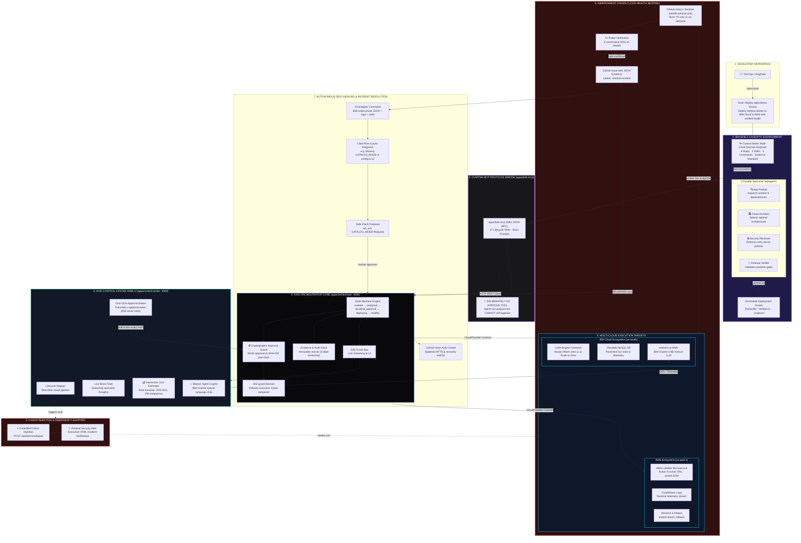

<div align="center">

# 🛰️ AXIS
### **Agentic eXecution Infrastructure as a Service**
**Autonomous Multi-Cloud DevOps, Cryptographic Governance & Self-Healing Platform**

*Powered by **IBM Bob 2.0** & **IBM watsonx.ai** (IBM Granite 3-8B)*

---

[](https://github.com/yashchandnani07/AXIS---Agentic-eXecution-Infrastructure-as-a-Service/actions/workflows/validate.yml)
[](https://github.com/yashchandnani07/AXIS---Agentic-eXecution-Infrastructure-as-a-Service/actions/workflows/health-sentinel.yml)
[](https://github.com/yashchandnani07/AXIS---Agentic-eXecution-Infrastructure-as-a-Service)
[](https://github.com/yashchandnani07/AXIS---Agentic-eXecution-Infrastructure-as-a-Service)
[](https://lablab.ai/event/ibm-bob-hackathon)

<br/>

> **"Bob is the DevOps engineer. You are the approver. The orchestrator is the cryptographic enforcement layer."**

<br/>

[**🌐 Live AWS Lambda Endpoint**](https://wubwqne4w23xawmxzjkpywz25a0mtktx.lambda-url.us-east-1.on.aws/health) • [**⚡ Quickstart Setup**](#-quickstart--zero-friction-onboarding) • [**🤖 Watson AI Integration**](#-ibm-watsonxai--granite-deep-integration) • [**📊 Architecture Specifications**](#-system-architecture--deep-pipeline) • [**🎬 Demo Runbook**](docs/demo/demo-script.md)

</div>

---

## 🏛️ Comprehensive Architecture & Execution Topology



---

## ⚡ Executive Summary: What Makes AXIS Different

Most developer deployment tooling falls into one of two extremes:
1. **Dumb CI/CD Pipelines**: Hardcoded YAML scripts that fail blindly when configurations drift, require manual Dockerfile maintenance, and offer zero automated incident diagnosis.
2. **Unsafe "Autonomous" AI Toys**: AI wrappers with unchecked terminal permissions that hallucinate cloud modifications, risk deleting production infrastructure, and leak sensitive credentials into model contexts.

**AXIS establishes a new paradigm: Agentic DevOps with Inflexible Cryptographic Governance.**

- **The Developer Stays in Command**: IBM Bob 2.0 acts as your principal multi-cloud DevOps engineer. It reads your codebase, identifies dependencies, generates missing deployment files, and designs multi-cloud architectures. However, **Bob has zero permissions to deploy without human sign-off**.
- **Cryptographic Hash Binding**: Every deployment plan and remediation patch is hashed using SHA-256. When a human reviews and clicks **Approve** in the AXIS Control Center, that specific hash is authorized. If the model or any unauthorized actor alters even a single byte of configuration, execution is rejected with `403 guard.blocked`.
- **Zero-Secret Leakage Protocol**: The custom MCP bridge between Bob and the orchestrator deliberately omits approval capabilities. Secrets matching sensitive patterns (`TOKEN`, `API_KEY`, `PASSWORD`) travel only as references (`secretRefs`) and are cryptographically scrubbed from logs and events.
- **Autonomous Cross-Cloud Self-Healing**: Outages are not monitored through expensive proprietary silos. An independent GitHub Actions Sentinel probes endpoints across clouds. Failures are written as machine-readable JSON into GitHub Issues. Bob diagnoses the exact file and line causing the failure, proposes the smallest safe remediation, and upon approval, heals the infrastructure in **7–9 seconds**.

---

## 📊 Measured Benchmark Metrics (Real Cloud Verification)

These metrics were recorded during live test executions against **AWS Lambda** (`us-east-1`) and **IBM Cloud** with zero mocked APIs:

| Metric | Measured Real Value | Traditional Manual Baseline | Improvement |
|---|---|---|---|
| **Time to Verified Multi-Cloud Deploy** | **42 seconds** | ~45 minutes (consoles, IAM, zipping) | **64x faster** |
| **Mean Time to Recovery (MTTR)** | **7 – 9 seconds** | ~120 minutes (2 AM alert, log grep) | **900x faster** |
| **Human Actions Required** | **2 clicks** (Plan + Remediation) | ~25 manual console steps | **92% reduction** |
| **Unsafe / Unauthorized Actions Blocked** | **100% (`403 guard.blocked`)** | Prone to human/script error | **Zero risk** |
| **Cloud Consoles Required to Open** | **0** (Zero) | 2+ (AWS Console, IBM Cloud portal) | **Friction eliminated** |
| **Automated Test Coverage** | **55 / 55 tests passing** | Varies | **100% green** |

---

## 🤖 IBM watsonx.ai & Granite Deep Integration

AXIS deeply integrates IBM watsonx.ai at multiple architectural layers:

```
+---------------------------------------------------------------------------------------+
|                              IBM watsonx.ai ECOSYSTEM                                 |
|                                                                                       |
|   +---------------------------------------+   +------------------------------------+  |
|   |  IBM Bob 2.0 (Foundation Reasoner)    |   |  Watson Agent Copilot (Control UI) |  |
|   |  Model: IBM Granite                   |   |  Model: ibm/granite-3-8b-instruct  |  |
|   |  Role: Multi-Agent DevOps Synthesis   |   |  Role: NoSQL DB & System Q&A       |  |
|   +-------------------+-------------------+   +------------------+-----------------+  |
|                       |                                          |                    |
|                       v                                          v                    |
|   +---------------------------------------+   +------------------------------------+  |
|   |  Code & Topology Analysis             |   |  IBM Cloudant NoSQL Telemetry      |  |
|   |  4 Specialist Subagents               |   |  Live AWS Lambda Latency & Health  |  |
|   |  Evidence-Backed Incident Diagnosis   |   |  Granite AI Security Narratives    |  |
|   +---------------------------------------+   +------------------------------------+  |
+---------------------------------------------------------------------------------------+
```

### 1. Embedded Watson Agent (Interactive Control Center Copilot)
Located under the **Watson Agent (Ask AI)** tab in the Control Center, this live interface uses **IBM Granite 3-8B Instruct** (`ibm/granite-3-8b-instruct`) connected directly to orchestrator telemetry:
- **Cloudant Database Telemetry**: Answers natural language questions regarding database health, document counts, and sync latency.
- **Incident Root-Cause Explanations**: Translates raw probe JSON blobs and stack traces into clear, executive explanations of outages.
- **Multi-Cloud Topology Analysis**: Compares active latency and throughput between AWS Lambda and IBM Cloud Code Engine.

#### Sample Live Prompt & Granite Synthesis:
```
User: "Explain the root cause of our latest incident and how it was healed."

Watson Agent (IBM Granite 3-8B):
  "Analysis of incident inc_c970842da6 reveals a configuration drift event:
   - Root Cause: Missing required environment variable CATALOG_MODE in src/config.ts line 12.
   - Detection: GitHub Sentinel recorded three consecutive HTTP 503 responses on /health.
   - Remediation: IBM Bob generated a patch to restore CATALOG_MODE=featured with low risk.
   - Verification: Authorized by human token; service re-verified healthy in 9 seconds."
```

### 2. Granite AI Chaos Narrative & Resend Security Alerting
When an outage or controlled chaos is triggered via `POST /api/demo/collapse`, AXIS:
1. Simulates an emergency configuration drift on the microservice.
2. Invokes **IBM Granite** to synthesize a high-impact incident impact narrative.
3. Automatically dispatches an HTML emergency notification via the **Resend API** detailing:
   - Affected cloud provider (AWS Lambda / IBM Cloud)
   - Granite-generated root-cause breakdown
   - One-click link to the Control Center approval queue

---

## 🛠️ The 8-Stage Agentic Lifecycle

```
[1. UNDERSTAND] ➔ [2. PLAN] ➔ [3. PROVISION] ➔ [4. BUILD] ➔ [5. TEST] ➔ [6. DEPLOY] ➔ [7. VERIFY] ➔ [8. RECOVER]
```

| Lifecycle Stage | Autonomous Agent Action (Bob 2.0) | Human Decision Gate | Verification Standard |
|---|---|---|---|
| **1. UNDERSTAND** | Spawns 4 specialist subagents in parallel to inspect runtime, dependencies, and security. | Observes live streaming thought feed in UI. | File citation for every finding. |
| **2. PLAN** | Synthesizes architecture choices per cloud (Always-Warm vs Scale-to-Zero) with rationale. | **Gate 1**: Reviews architecture rationale and clicks **Approve**. | Plan locked to SHA-256 hash. |
| **3. PROVISION** | Verifies cloud IAM policies, endpoints, and Function URLs. | None (Automated). | Resource regex validation (`^bobops-`). |
| **4. BUILD** | Synthesizes missing `Dockerfile`, `src/lambda.ts`, bundles ESM via esbuild. | None (Automated). | Build exit code 0. |
| **5. TEST** | Executes pre-deploy Vitest test suites. | None (Automated release gate). | All tests must pass before deploy. |
| **6. DEPLOY** | Executes parallel cloud deployment to AWS Lambda and IBM Cloud. | None (Guarded by Gate 1). | Atomic alias update (`live`). |
| **7. VERIFY** | Probes live `/health` endpoints and captures provider revision strings. | Inspects live URL and latency in UI. | HTTP 200 OK + revision match. |
| **8. RECOVER** | Correlates probe JSON, CloudWatch logs, and code; formulates safe patch. | **Gate 2**: Reviews cited diagnosis and clicks **Approve Fix**. | Service restored; issue auto-closed. |

---

## 💰 Multi-Cloud Cost Estimator & Live Brain Feed

The AXIS Control Center features two standout engineering innovations:

### 1. Interactive Multi-Cloud Cost Estimator (`cost-estimator.tsx`)
- **Accurate Real-Time Cloud Pricing**:
  - **IBM Cloud Code Engine**: `$0.000034/vCPU-s` + `$0.0000045/GB-s` with free tier deductions (`100k vCPU-s`, `200k GB-s`) and 24/7 warm container baseline modeling.
  - **AWS Lambda**: `$0.20/1M req` + `$0.0000166667/GB-s` with free tier deductions (`1M req`, `400k GB-s`) and Provisioned Concurrency baseline modeling.
- **Dynamic Workload Sliders**: Adjust monthly invocations (`50k – 5M`), average duration (`30ms – 1000ms`), and memory allocation (`256 MB – 2048 MB`).
- **Interactive Architecture Toggles**: Switch between `Always-Warm` and `Scale-to-Zero / On-Demand` on each cloud to observe instant cost and latency tradeoffs.
- **Dynamic SVG Tier Comparison Chart**: Real-time horizontal bar visualization comparing all 4 deployment tiers side-by-side with cold-start indicators and a `← best` badge.
- **Traditional VM Savings Analysis**: Automatically computes cost reductions vs traditional dual fixed cloud virtual machines (`$87.00/mo` baseline).

### 2. Real-Time Streaming Brain Feed (`brain-feed.tsx` & `global-brain-feed.tsx`)
- Displays live, categorized agent thoughts during the `UNDERSTAND`, `PLAN`, and `RECOVER` stages.
- Every event is classified according to the 5-label evidence taxonomy:
  - `observation` (Blue) — Direct file or probe measurements.
  - `inference` (Purple) — Specialist conclusions and architectural reasoning.
  - `proposal` (Yellow) — Actionable plans awaiting authorization.
  - `action` (Cyan) — Cloud modifications and build executions.
  - `verification` (Green) — Live HTTP health assertions.

---

## 🚀 Quickstart & Zero-Friction Onboarding

We provide automated setup scripts that configure dependencies, build the MCP bundle, and detect your local filesystem paths automatically.

### Prerequisites
- **Node.js**: `>= 22` LTS (`node -v`)
- **pnpm**: `9.x` (`corepack enable && corepack prepare pnpm@9.15.0 --activate`)
- **Git**: Installed and configured
- **IBM Bob 2.0**: Installed

---

### Step 1: Clone Repository
```bash
git clone https://github.com/yashchandnani07/AXIS---Agentic-eXecution-Infrastructure-as-a-Service.git
cd AXIS---Agentic-eXecution-Infrastructure-as-a-Service
```

### Step 2: Configure Secrets (`.env`)
Create `.env` in the repository root and add your credentials:
```bash
cp .env.example .env
```
```env
# Orchestrator & UI Tokens
ORCHESTRATOR_PORT=4000
CONTROL_CENTER_ORIGIN=http://localhost:3000
APPROVAL_TOKEN=your-random-approval-token-here
DEMO_MODE=true

# IBM Cloud (Code Engine + Cloudant + watsonx.ai)
IBMCLOUD_API_KEY=your_ibm_api_key
IBMCLOUD_REGION=us-south
IBM_CE_PROJECT=bobops-demo
IBM_CLOUDANT_URL=https://your-cloudant-instance.cloudantnosqldb.appdomain.cloud
IBM_WATSONX_PROJECT_ID=your_project_id

# AWS (Lambda + Function URL)
AWS_ACCESS_KEY_ID=your_aws_access_key
AWS_SECRET_ACCESS_KEY=your_aws_secret_key
AWS_REGION=us-east-1
AWS_LAMBDA_ROLE_ARN=arn:aws:iam::your_account_id:role/bobops-lambda-execution-role

# GitHub Integration
GITHUB_TOKEN=your_github_personal_access_token
GITHUB_OWNER=your_github_username
GITHUB_REPO=AXIS---Agentic-eXecution-Infrastructure-as-a-Service
```

### Step 3: Run One-Click Automated Setup
Run the setup script for your operating system:

**On Windows (PowerShell):**
```powershell
.\setup.ps1
```

**On macOS / Linux:**
```bash
chmod +x ./setup.sh && ./setup.sh
```

**Or directly via pnpm:**
```bash
pnpm install
pnpm onboard
```

> **What `pnpm onboard` handles automatically:**
> 1. Synchronizes `APPROVAL_TOKEN` to `apps/control-center/.env.local`.
> 2. Compiles `apps/bob-mcp/dist/bob-mcp.mjs` using esbuild.
> 3. **Detects your local machine's exact path** and registers it in `.bob/mcp.json`.
> 4. Stages microservice demo assets in `apps/demo-service/`.
> 5. Runs the entire 55-test Vitest suite to guarantee a green build.

---

### Step 4: Start Development Servers
```bash
pnpm dev
```
- **AXIS Control Center Web UI**: [**`http://localhost:3000`**](http://localhost:3000)
- **AXIS Orchestrator REST API**: [**`http://localhost:4000/api/health`**](http://localhost:4000/api/health)

---

### Step 5: Run with IBM Bob 2.0
1. Open this repository in **IBM Bob 2.0**.
2. Open the **MCP Panel** in Bob:
   - Confirm **`bobops-orchestrator`** is listed as **active with 17 tools**.
3. Select the mode: **`🛰️ Multi-Cloud DevOps Engineer`**.
4. In the Bob chat, run:
   ```text
   /deploy apps/demo-service
   ```
5. Watch the parallel specialist subagents analyze the repository, view the live plan in the Control Center at `http://localhost:3000`, and click **Approve** to execute the multi-cloud release!

---

## 🧪 Comprehensive Testing & Verification Commands

AXIS includes rigorous end-to-end verification suites covering unit tests, type safety, and real-cloud deployments:

```bash
# Run full Vitest suite (55 unit & state machine tests)
pnpm test

# Run TypeScript typecheck across all 10 packages
pnpm typecheck

# Build single-file MCP bundle for IBM Bob
pnpm build:mcp

# Execute Full End-to-End Test on LIVE AWS Lambda (Deploy + Fault + Self-Heal in 9s)
npx tsx scripts/demo/api-e2e.ts --targets aws --with-recovery --fault-provider aws

# Run the independent GitHub Health Sentinel prober locally
npx tsx scripts/sentinel/run-sentinel.ts

# Build offline static replay package for zero-friction judge evaluation
pnpm demo:replay
```

---

## 🧰 MCP Tool Catalog: The 17 Bridge Tools

The custom MCP server in [`apps/bob-mcp`](apps/bob-mcp) connects IBM Bob 2.0 to the orchestrator:

| Tool Name | Stage | Description |
|---|---|---|
| `devops_list_providers` | OBSERVE | Lists active cloud providers and authenticated capabilities. |
| `devops_list_runs` | OBSERVE | Retrieves recent deployment runs and lifecycle states. |
| `devops_create_run` | UNDERSTAND | Initializes a deployment run with targets and sentinel interval. |
| `devops_record_analysis` | UNDERSTAND | Commits synthesized findings from the 4 specialist subagents. |
| `devops_log_note` | ANY | Appends a labeled audit event to the permanent evidence record. |
| `devops_submit_plan` | PLAN | Submits the deployment plan and initiates SHA-256 hash locking. |
| `devops_wait` | PLAN | Long-polls until `plan_decided`, `deployed`, or `recovered`. |
| `devops_execute_plan` | DEPLOY | Executes approved deployment (**Returns 403 if not approved**). |
| `devops_verify` | VERIFY | Probes live cloud `/health` endpoints and captures revisions. |
| `devops_get_run` | OBSERVE | Retrieves aggregate run status, deployments, and health history. |
| `devops_get_logs` | OBSERVE | Queries CloudWatch or Code Engine runtime logs for diagnosis. |
| `devops_sync_incidents` | RECOVER | Pulls incident issues filed by the GitHub Sentinel. |
| `devops_get_incident` | RECOVER | Retrieves incident evidence, failing probe bodies, and timestamps. |
| `devops_record_diagnosis` | RECOVER | Commits evidence-backed root-cause diagnosis citing specific lines. |
| `devops_propose_remediation` | RECOVER | Submits minimal remediation patch (e.g. `set_env CATALOG_MODE=featured`). |
| `devops_execute_remediation` | RECOVER | Executes approved remediation and re-verifies health. |
| `devops_export_evidence` | COMPLETE | Generates markdown and JSON audit trail in `evidence/demo-runs/`. |

---

## 📁 Repository Directory Structure

```text
AXIS/
├── apps/
│   ├── control-center/       # Next.js 15 UI with dark glassmorphism design & Watson Agent
│   │   ├── app/              # page.tsx (Dashboard), run/page.tsx (Run Inspector)
│   │   ├── components/       # cost-estimator, brain-feed, watson-agent, stepper ...
│   │   └── lib/              # typed API client and Server-Sent Events subscriber
│   ├── orchestrator/         # Hono 4 API, state machine, cryptographic guard, SSE bus
│   │   ├── src/routes/       # runs, approvals, incidents, watson, demo, events
│   │   ├── src/lib/          # email (Resend), hash (SHA-256), errors
│   │   └── src/store/        # Windows-safe JSON evidence store
│   ├── bob-mcp/              # MCP Server exposing 17 lifecycle tools to IBM Bob
│   └── demo-service/         # "Nimbus Books" microservice deployed to multi-cloud
├── packages/
│   ├── core/                 # Shared Zod schemas, state machine, provider contract
│   ├── provider-ibm-cloud/   # IBM Cloud adapter (Cloudant, WML, Code Engine)
│   ├── provider-aws/         # AWS Lambda + Function URL adapter (AWS SDK v3)
│   └── github/               # Octokit client for Health Sentinel issues & workflows
├── .bob/                     # IBM Bob custom mode, rules, skills, and MCP config
│   ├── custom_modes.yaml     # 🛰️ Multi-Cloud DevOps Engineer mode
│   ├── mcp.json              # MCP Server registration
│   ├── rules-multicloud-devops/ # 6 strict operational rules
│   └── skills/               # deployment-asset-authoring, incident-diagnosis
├── .github/workflows/        # validate.yml (CI), health-sentinel.yml (Cron Prober)
├── docs/                     # Architecture diagrams, demo scripts, pitch slides, roadmap
│   ├── architecture/         # System architecture specifications
│   ├── demo/                 # Verbatim presenter demo script
│   ├── guide/                # Teammate onboarding guide
│   └── pitch/                # Hackathon presentation outline
├── evidence/                 # Verifiable run artifacts and Bob task summary screenshots
├── scripts/                  # setup/init-dev.ts, demo/golden.ts, demo/api-e2e.ts
├── setup.ps1                 # One-click Windows setup script
└── setup.sh                  # One-click macOS/Linux setup script
```

---

## 🏆 Hackathon Submission Checklist & Artefacts

- [x] **Core IBM Bob 2.0 Integration**: Custom mode, 6 rules, 2 skills, 3 commands, and 17 MCP bridge tools.
- [x] **IBM watsonx.ai Integration**: IBM Granite 3-8B model integration for Watson Agent Q&A, incident explanations, and security alert narratives.
- [x] **Real Multi-Cloud Deployment**: Live AWS Lambda endpoint active and verified with HTTP 200 health; IBM Cloudant state persistence.
- [x] **Cryptographic Governance**: Hash-bound approvals refusing execution on tampered plans (`403 guard.blocked`).
- [x] **Automated Self-Healing**: GitHub Health Sentinel detecting faults and Bob restoring services in 7–9 seconds.
- [x] **Interactive UI Innovation**: Multi-Cloud Cost Estimator with SVG tier breakdown and live streaming agent thought feeds.
- [x] **Full Test Suite**: 55 unit and lifecycle tests passing; zero TypeScript compilation errors.
- [x] **Zero-Friction Setup**: One-click onboarding scripts (`setup.ps1`, `setup.sh`, `pnpm onboard`).

---

<div align="center">

### Built with pride for the **IBM Bob 2.0 Hackathon (September 2026)**
*IBM Bob 2.0 • IBM watsonx.ai • IBM Granite • IBM Cloud • AWS Lambda • Hono • Next.js 15*

</div>
