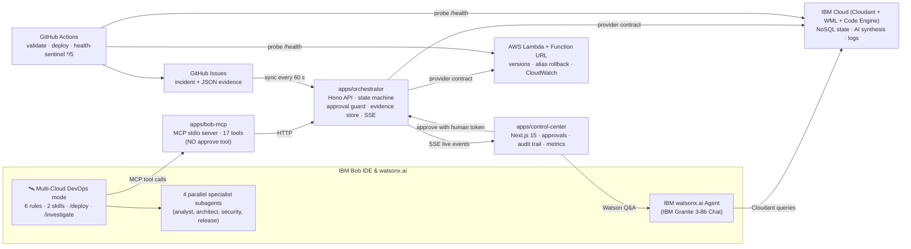
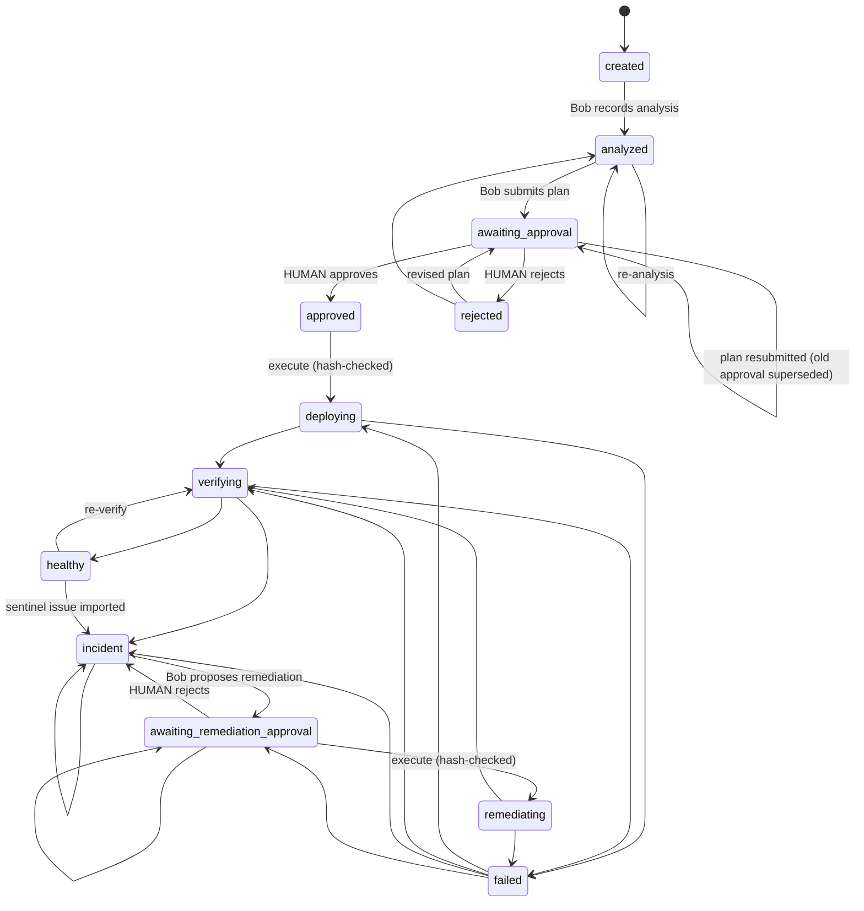
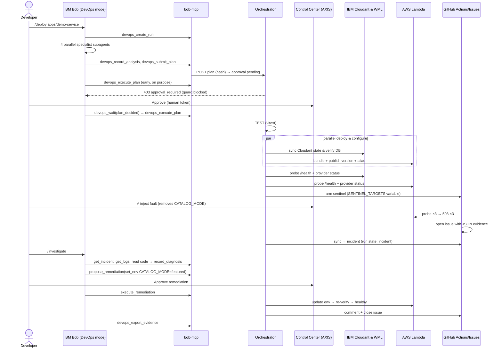

<!-- @file docs/architecture/overview.md  @phase P14  @purpose Architecture for judges and contributors. -->
# AXIS Architecture

A TypeScript modular monorepo: fast to build, clean boundaries for new cloud providers. Provider-independent lifecycle in `packages/core` + `apps/orchestrator`; cloud specifics isolated behind `CloudProvider`.

---

## 1. System Architecture

---

## 2. Run State Machine

---

## 3. The Demo & Self-Healing Lifecycle

