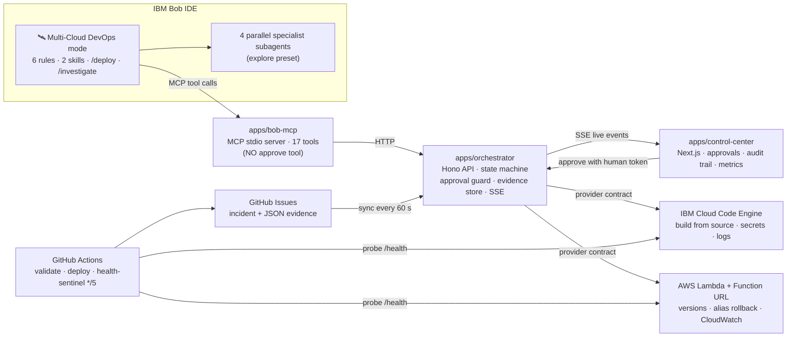
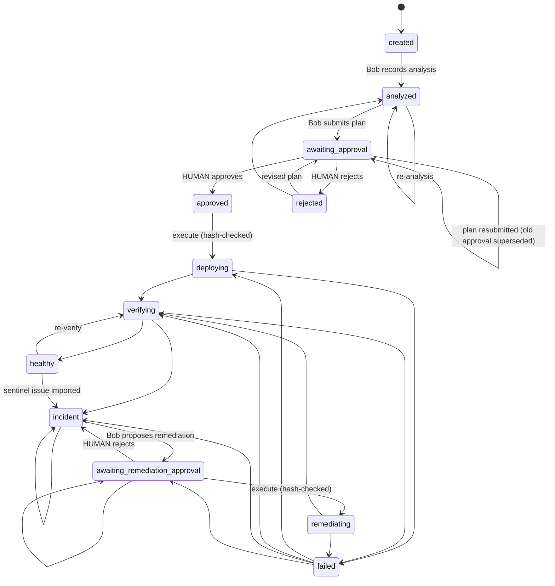
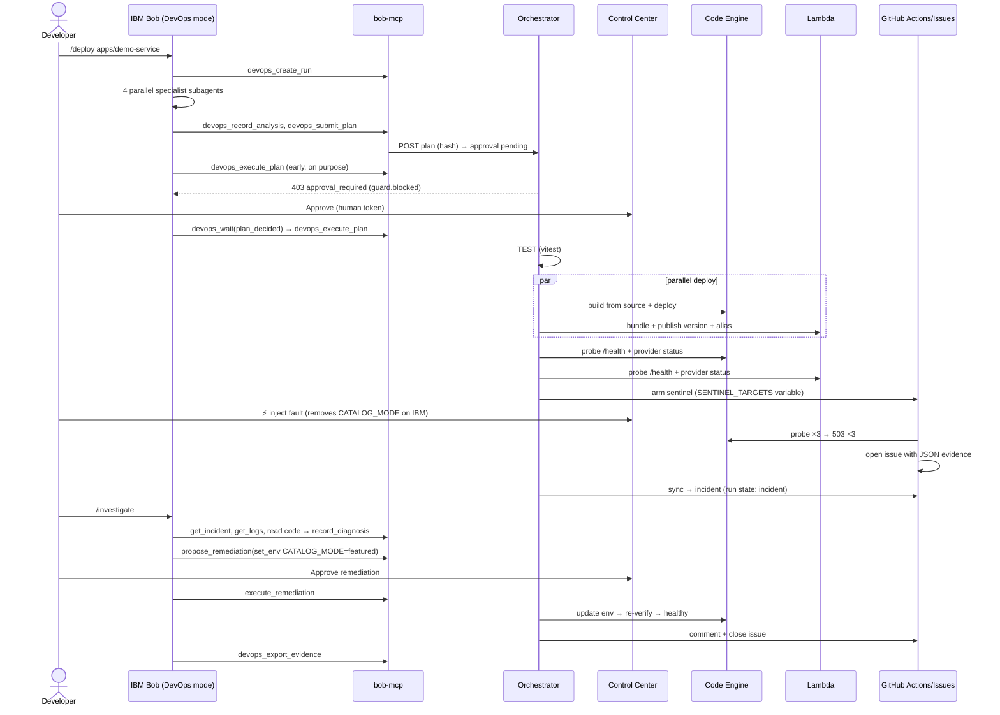

# BobOps — Agentic Multi-Cloud DevOps Engineer · MASTER IMPLEMENTATION PLAN

> **For agentic workers (IBM Bob, or any coding agent):** Do ONE phase at a time. Before you start a phase, read this file's
> sections **§6 Global Constraints**, **§8 Contracts cheat-sheet** and **§9 Conventions**, and then the phase file you were
> asked to run, e.g. `docs/plan/phase-04-orchestrator-runs.md`. Do exactly what the phase file says, in order. Each step uses
> checkbox (`- [ ]`) syntax. A phase **ends with a HANDOFF block** (see §10.3) that you print to the human. **Never start the
> next phase on your own.**

**Goal:** Ship a working, demo-ready prototype where IBM Bob takes a real repository through an approval-gated,
evidence-backed lifecycle (UNDERSTAND → PLAN → PROVISION → BUILD → TEST → DEPLOY → VERIFY → RECOVER) on **IBM Cloud Code
Engine** and **AWS Lambda**. The prototype also needs a Control Center UI and a GitHub Actions health sentinel.

**Architecture:** This is a TypeScript pnpm monorepo. `packages/core` owns every schema, the state machine and the provider
contract. `apps/orchestrator` is a Hono API that runs the lifecycle and enforces human approvals with plan hashes. IBM Bob
drives the orchestrator through a custom MCP server (`apps/bob-mcp`), and that server deliberately has **no approve tool**.
A human approves in the Next.js Control Center (`apps/control-center`). Two provider adapters perform the real cloud work.
A GitHub Actions sentinel files incidents as GitHub issues that carry JSON evidence, and the orchestrator imports them.

**Tech Stack:** Node 22 · pnpm 9 workspaces · TypeScript 5 (ESM, run with `tsx`, bundled with `esbuild`) · zod 3.25 · Hono 4 ·
Vitest 3 · Next.js 15 + Tailwind v4 · @modelcontextprotocol/sdk 1.x · execa 9 · IBM Cloud CLI + Code Engine plugin ·
AWS SDK v3 (Lambda, CloudWatch Logs, STS) · Octokit · GitHub Actions.

**Spec:** [`PRD.md`](../../PRD.md). This plan implements it. Where the plan deliberately deviates, the deviation is listed in §5.3.

---

## Table of contents

1. [Situation and deadline](#1-situation-and-deadline)
2. [What the judges reward (research)](#2-what-the-judges-reward-research)
3. [Winning strategy](#3-winning-strategy)
4. [The product in three pictures](#4-the-product-in-three-pictures)
5. [Technical decisions](#5-technical-decisions)
6. [Global Constraints](#6-global-constraints)
7. [Directory and file structure](#7-directory-and-file-structure)
8. [Contracts cheat-sheet](#8-contracts-cheat-sheet)
9. [Conventions (every file, every agent)](#9-conventions-every-file-every-agent)
10. [How to execute this plan with IBM Bob](#10-how-to-execute-this-plan-with-ibm-bob)
11. [Phase index](#11-phase-index)
12. [Timeline, team split and cut lines](#12-timeline-team-split-and-cut-lines)
13. [Risk register and fallbacks](#13-risk-register-and-fallbacks)
14. [Sources](#14-sources)

---

## 1. Situation and deadline

| Item | Value |
|---|---|
| Event | IBM Bob 2.0 Hackathon (lablab.ai), online, 48 h, Sep 25–27 2026 |
| **Submission deadline** | **Sep 27 2026, 15:00 UTC (= 20:30 IST)**. Re-check it on the lablab event page the moment you start. |
| Prize pool | $12,000 total (lablab page); per-place split not published |
| Bob budget | **40 Bobcoins per participant.** No top-ups after 100% usage. Spend them on the phases that matter (see §10.4). |
| Team | 2 people (PRD §14): **P = Product & Experience**, **O = Orchestration & Cloud**. Solo is possible with the cut lines in §12. |

The time is short, so the plan is built around one rule: **get one happy path working end to end early (Phase 8), then
add breadth.**

## 2. What the judges reward (research)

From the official hackathon guide and the lablab event page (see §14):

| Criterion | What it means for us | How this plan scores it |
|---|---|---|
| **Application of Technology** (mandatory: *meaningful* IBM Bob use; Bob IDE must be a **core component**) | Bob has to be visibly central to the product, not an invisible autocomplete. The judges want to see Agent mode, parallel tasks, subagents and document understanding "across multiple workflow stages". | A custom Bob **mode** plus 6 mode **rules**, 2 **skills** and 3 **slash commands**, **plus a custom MCP server we built**. There are **4 parallel specialist subagents**, a **todo list** that mirrors the lifecycle, and **document understanding** of incident JSON, logs, the PRD and the plan. Bob was also used to *build* every phase, and the screenshots are committed as evidence. |
| **Originality** | This must not be "yet another AI dashboard / CI-file generator" (PRD §1). | (1) An **approval bound to a plan hash**, so Bob cannot deploy a plan that differs from what the human approved. (2) An **MCP bridge with no approve capability**: Bob proposes and humans decide. (3) An **evidence taxonomy** on every audit event (observation / inference / proposal / action / verification). (4) **GitHub Issues used as the cross-cloud incident bus**, with machine-readable evidence. (5) **One provider contract** serving IBM Cloud and AWS, with V2 slots for Vercel and Railway. |
| **Business Value** | The solution should make a painful developer workflow measurably better. | The Control Center shows **"run created → verified on 2 clouds"** time, **MTTR**, **human approvals** and **unsafe actions blocked**. The demo frames a manual release (consoles, logs, guesswork) against a single Bob conversation. |

**Mandatory submission artefacts** (lablab): **slide deck, cover image, demo video, demo URL**, plus a **public GitHub repo**
with docs and **every Bob IDE task session summary screenshot**. Phase 14 produces all of them.

**Data rules:** use no confidential, client or personal data. Our demo app uses a hard-coded public-domain book catalog.

## 3. Winning strategy

### 3.1 The five "wow moments" the demo must hit (in this order)

1. **Parallel specialists, real architecture decisions.** You type `/deploy apps/demo-service` in Bob. Bob spawns
   **4 subagents at once** (application analyst, cloud architect, security reviewer, release verifier), and the aggregate
   subagent panel shows them running in parallel. The cloud-architect specialist doesn't just pick "IBM + AWS" — for
   EACH cloud it chooses between two real, independently deployable architectures (always-on vs. scale-to-zero on Code
   Engine; on-demand vs. provisioned-concurrency on Lambda), citing the app's traffic/latency profile. Bob then
   synthesizes a single plan carrying that rationale as a required, schema-validated field.
2. **"Bob cannot bypass you."** Bob submits the plan, and the Control Center lights up with an approval card that shows the
   plan hash. Bob tries `devops_execute_plan` early *on purpose*, and the orchestrator answers **403 `guard.blocked`**. That
   event appears in the audit trail.
3. **One plan, two real clouds.** You approve the plan. Tests run first, then **IBM Cloud Code Engine** (building from
   source) and **AWS Lambda** deploy in parallel. The run shows two real URLs, provider-native status and HTTP health
   evidence.
4. **Break it live.** Press "⚡ Inject controlled fault". The GitHub sentinel workflow opens a **GitHub issue with JSON
   evidence**, and the incident appears in the Control Center within 60 s.
5. **Evidence-driven recovery.** You type `/investigate` in Bob. Bob reads the probe body, the logs and the code, and records
   a diagnosis that cites evidence. It proposes `set_env CATALOG_MODE=featured` and waits for approval. You approve, the
   change runs and is re-verified, and **the GitHub issue closes itself** with a recovery comment. The audit trail is then
   exported.

### 3.2 The three sentences to repeat everywhere (README, slides, video)

- "Bob is the DevOps engineer, you are the approver, and the orchestrator is the enforcement layer."
- "Every claim is evidence, and every cloud change is approved."
- "One provider contract covers IBM Cloud and AWS today, with Vercel and Railway in V2 without touching the workflow."

## 4. The product in three pictures

### 4.1 System architecture



### 4.2 Run state machine (implemented in `packages/core/src/state-machine.ts`)



### 4.3 The demo lifecycle (sequence)



## 5. Technical decisions

### 5.1 Decisions and rationale

| Decision | Why |
|---|---|
| **pnpm workspaces, no Turborepo** | Fewer moving parts. `pnpm -r` is enough at this size. |
| **Backend TS is never compiled, it runs with `tsx`** | No build step, which removes a whole class of "stale dist" bugs. Packages export `./src/index.ts` directly. |
| **Only 2 things are bundled with esbuild**: the MCP server (so Bob can launch it with plain `node`) and the Lambda handler | Bob launches MCP servers as a child process. A single `.mjs` file with no workspace resolution is the most reliable choice on Windows. |
| **Hono for both the orchestrator and the demo app** | One HTTP framework to learn. It runs on Node *and* AWS Lambda (`hono/aws-lambda`). |
| **IBM Cloud = Code Engine, built from local source with a Dockerfile** | Real IBM-native build and deploy with no local Docker needed. Secrets use Code Engine secrets, and logs come from `ibmcloud ce app logs`. |
| **AWS = Lambda + Function URL + `live` alias** | Deploys in seconds and costs about nothing. Versions plus an alias give a clean, instant **rollback** story. |
| **The IBM adapter calls the `ibmcloud` CLI through `execa`, with JSON output and tolerant parsers** | This is the fastest path to a working adapter. Parsers accept both known JSON shapes and are unit tested. |
| **JSON-file store** (`apps/orchestrator/.data/store.json`) | No database to provision. The file is human-readable and is exported as evidence. |
| **Approvals are bound to `sha256(stableStringify(plan))`** | If the plan changes after approval, execution is refused. This is the originality centrepiece. |
| **MCP server with no approve tool; approvals need `x-approval-token` known only to the UI** | Defense in depth. It holds even if the model tries to "help". `.bobignore` hides `.env*` from Bob. |
| **Sentinel → GitHub Issue (JSON block) → orchestrator sync** | A GitHub runner cannot reach a laptop-hosted orchestrator. Issues are durable, visible and auditable, and give us a free incident UI. |
| **Resource names must match `^bobops-[a-z0-9-]{3,40}$`** | Enforced by schema. It is a safety boundary, so Bob can only touch resources we own. |
| **Full-file replacements in later phases** (not diffs) | Weak models apply full files much more reliably than surgical diffs. |

### 5.2 The demo application: "Nimbus Books" (`apps/demo-service`)

This is a tiny but real catalog API. `GET /health` returns **503** with `checks.config.missing: ["CATALOG_MODE"]` when the
required env value is missing. That is our **safe, repeatable controlled fault** (PRD §9): the fault removes the env value,
and the remediation restores it.

The **deployment assets** (`Dockerfile`, `.dockerignore`, `.ceignore`, `src/lambda.ts`) are **not** hand-authored in the
demo repo. **Bob generates them live** with the `deployment-asset-authoring` skill. Golden copies live in `docs/demo/golden/`
and are used only for smoke tests and as a fallback (`pnpm demo:golden`).

### 5.3 Deliberate deviations from the PRD (tell the judges; they show judgment)

| PRD says | Plan does | Reason |
|---|---|---|
| `packages/ui` for shared components | Components live in `apps/control-center/components/` | There is only one consumer. Extract in V2 (YAGNI). |
| (not listed) | **Added `apps/bob-mcp/`** | This is how Bob drives the orchestrator. It is essential to "Bob as core component". |
| (not listed) | **Added `scripts/` as a workspace package** (`@bobops/scripts`) | Sentinel, smoke tests, demo tools and the CI deploy script need workspace imports. |
| `infra/ibm-cloud/` IaC | Idempotent `bootstrap.ps1` (CLI) plus a README | Terraform install and debugging costs hours we don't have. The script is still versioned infrastructure. |

## 6. Global Constraints

Every phase implicitly includes these. **Copy values exactly.**

- **Node** `>=22` (LTS). **pnpm** `9.x` (activated through corepack). **TypeScript** `^5.8`. **ESM everywhere** (`"type": "module"`).
- **zod pinned to `^3.25.0`** in every package that uses it. Always `import { z } from 'zod'` (the v3 API). Never import `zod/v4`.
- **Package scope** `@bobops/*`. Workspace dependencies are written `"workspace:*"`.
- **Ports:** orchestrator `4000`, control-center `3000`, demo-service local `8080`.
- **Regions:** IBM `us-south`, AWS `us-east-1`. **Code Engine project:** `bobops-demo`. **Resource group:** `Default`.
- **All deployed resource names match `^bobops-[a-z0-9-]{3,40}$`.** The demo app name is `bobops-nimbus-books`.
- **Lambda:** runtime `nodejs22.x`, handler `lambda.handler`, arch `arm64`, alias `live`, memory 256 MB, timeout 10 s.
- **Code Engine app:** port 8080, `--min-scale 1 --max-scale 2 --cpu 0.25 --memory 0.5G`.
- **Required demo env:** `CATALOG_MODE=featured`. **Secret:** `ADMIN_TOKEN`, sourced from `.env` key `SECRET_ADMIN_TOKEN`.
- **Secrets never appear in:** plan `env`, events, evidence, logs, the Bob chat or git. Keys matching
  `/(TOKEN|SECRET|PASSWORD|API_?KEY|PRIVATE)/i` are secret by definition (`isSecretKey` in core).
- **Human-only operations** need header `x-approval-token: <APPROVAL_TOKEN>`: deciding approvals and injecting faults.
- **Bob must never run cloud-mutating CLI commands** (`ibmcloud … create|update|delete`, `aws …`, `gh … create|edit|delete`)
  in a terminal. All cloud changes go through the orchestrator's MCP tools.
- **Windows first:** commands in this plan are PowerShell-compatible. Use `curl.exe` (not `curl`) or `Invoke-RestMethod`.
- **Every source file starts with the context header** from §9.1.
- **Tests:** Vitest. `pnpm test` from the repo root must stay green at the end of every phase.

## 7. Directory and file structure

Legend: `(Pn)` = the phase that creates the file. ★ = the file is regenerated live by Bob during the demo.

```text
IBM-Bob/                                   # repo root (GitHub repo: bobops)
├── PRD.md                                 # product spec (exists)
├── README.md                    (P14)     # judge-facing overview, quickstart, Bob-usage map
├── AGENTS.md                    (P1)      # auto-loaded by Bob in every mode: build rules for agents
├── package.json                 (P1)      # root scripts (dev, test, typecheck, demo:*)
├── pnpm-workspace.yaml          (P1)
├── tsconfig.base.json           (P1)
├── vitest.config.ts             (P1)
├── .env.example                 (P1)      # every env var, documented
├── .gitignore  .bobignore       (P1)      # .bobignore hides secrets from Bob
│
├── .bob/                                  # ── IBM Bob configuration (version-controlled) ──
│   ├── custom_modes.yaml        (P10)     # 🛰️ Multi-Cloud DevOps Engineer mode
│   ├── mcp.json                 (P9)      # registers apps/bob-mcp as "bobops-orchestrator"
│   ├── rules-multicloud-devops/ (P10)
│   │   ├── 01-evidence-standard.md
│   │   ├── 02-approval-gates.md
│   │   ├── 03-cloud-safety-boundaries.md
│   │   ├── 04-specialists-and-synthesis.md
│   │   ├── 05-deploy-workflow.md
│   │   └── 06-incident-response.md
│   ├── skills/
│   │   ├── deployment-asset-authoring/SKILL.md (P10)
│   │   └── incident-diagnosis/SKILL.md         (P10)
│   └── commands/
│       ├── run-phase.md         (P1)      # /run-phase NN  → executes docs/plan/phase-NN-*.md
│       ├── deploy.md            (P10)     # /deploy <repoPath>
│       └── investigate.md       (P10)     # /investigate
│
├── apps/
│   ├── demo-service/            (P3)      # "Nimbus Books" Hono API = the repository Bob deploys
│   │   ├── package.json  tsconfig.json
│   │   ├── src/app.ts  src/catalog.ts  src/config.ts  src/server.ts  src/app.test.ts
│   │   ├── src/lambda.ts        ★         # generated by Bob (golden copy in docs/demo/golden/)
│   │   └── Dockerfile  .dockerignore  .ceignore   ★
│   ├── orchestrator/            (P4,P5,P8,P12)
│   │   ├── package.json  tsconfig.json
│   │   └── src/
│   │       ├── index.ts  app.ts  config.ts  deps.ts  ports.ts  github.ts
│   │       ├── lib/errors.ts  lib/hash.ts
│   │       ├── store/json-store.ts
│   │       ├── events/event-bus.ts
│   │       ├── services/run-service.ts  services/lifecycle-service.ts  services/test-runner.ts
│   │       ├── providers/registry.ts
│   │       ├── routes/runs.ts  approvals.ts  incidents.ts  providers.ts  events.ts  demo.ts
│   │       ├── testing/fake-provider.ts
│   │       └── app.test.ts  lifecycle.test.ts
│   ├── bob-mcp/                 (P9)      # MCP stdio server that exposes the orchestrator to Bob
│   │   ├── package.json  tsconfig.json  build.mjs
│   │   └── src/index.ts  client.ts  tools.ts  summarize.ts  summarize.test.ts  selftest.ts
│   └── control-center/          (P11)     # Next.js 15 product UI
│       ├── package.json  next.config.ts  .env.local(.example)
│       ├── app/layout.tsx  app/globals.css  app/page.tsx  app/run/page.tsx
│       ├── lib/api.ts  lib/use-run.ts  lib/format.ts
│       └── components/ui.tsx  provider-cards.tsx  runs-table.tsx  lifecycle-stepper.tsx
│           metrics-strip.tsx  approval-queue.tsx  analysis-panel.tsx  plan-panel.tsx
│           deployments-panel.tsx  incidents-panel.tsx  logs-panel.tsx  audit-trail.tsx
│
├── packages/
│   ├── core/                    (P2)      # schemas · state machine · provider contract · probe · sentinel format
│   │   └── src/index.ts schemas.ts events.ts state-machine.ts provider-contract.ts util.ts
│   │       redact.ts probe.ts metrics.ts audit.ts sentinel.ts fixtures.ts  (+ *.test.ts)
│   ├── provider-ibm-cloud/      (P6)      # Code Engine adapter (ibmcloud CLI)
│   │   └── src/index.ts cli.ts parse.ts provider.ts parse.test.ts
│   ├── provider-aws/            (P7)      # Lambda adapter (AWS SDK v3)
│   │   └── src/index.ts bundle.ts versions.ts provider.ts versions.test.ts
│   └── github/                  (P12)     # Octokit client: issues, comments, repo variables
│       └── src/index.ts client.ts
│
├── scripts/                     (P1…)     # workspace package @bobops/scripts
│   ├── package.json  tsconfig.json
│   ├── lib/env.ts                         # loads root .env, exports REPO_ROOT
│   ├── demo/golden.ts  reset.ts (P3)  inject-fault.ts  api-e2e.ts (P8)  build-replay.ts (P14)
│   ├── smoke/deploy-ibm.ts (P6)  deploy-aws.ts (P7)
│   ├── sentinel/run-sentinel.ts (P12)
│   └── ci/deploy.ts (P12, COULD)
│
├── infra/
│   ├── ibm-cloud/bootstrap.ps1  README.md (P6)  replay-site/Dockerfile default.conf (P14)
│   └── aws/lambda-execution-role.yaml  deployer-policy.json  README.md (P7)
│
├── .github/workflows/validate.yml  health-sentinel.yml  deploy.yml   (P12)
│
├── docs/
│   ├── plan/                              # THIS PLAN (00-MASTER + phase files)
│   ├── architecture/overview.md (P14)
│   ├── demo/golden/Dockerfile .dockerignore .ceignore lambda.ts (P3)
│   ├── demo/demo-script.md  video-script.md (P13/P14)
│   ├── pitch/slides-outline.md  cover-image.md (P14)
│   └── roadmap/v2-vercel-railway.md (P14)
│
└── evidence/
    ├── bob-task-summaries/                # ONE screenshot per Bob task (mandatory for judging)
    └── demo-runs/                         # exported audit trails (<runId>.json/.md, providers.json)
```

## 8. Contracts cheat-sheet

The code lives in `packages/core`. This section is the map. The phase files hold the full code.

### 8.1 Event taxonomy

Every audit event has `actor` and `kind`, where `kind` is one of `observation | inference | proposal | action | verification`
(PRD §6). Actors are `bob | human | orchestrator | sentinel | provider:ibm-cloud | provider:aws`.

Event `type` → lifecycle stage mapping (used by the UI stepper):

| Prefix | Stage | Prefix | Stage |
|---|---|---|---|
| `run.` `analysis.` `specialist.` | UNDERSTAND | `deploy.` | DEPLOY |
| `plan.` `approval.` | PLAN | `verify.` `sentinel.` | VERIFY |
| `provision.` | PROVISION | `fault.` `incident.` `remediation.` | RECOVER |
| `build.` | BUILD | `bob.note` `guard.blocked` `provider.progress` `orchestrator.warning` `evidence.exported` | (none) |
| `test.` | TEST | | |

### 8.2 Orchestrator HTTP API (`http://localhost:4000`)

| Method & path | Caller | Purpose |
|---|---|---|
| `GET /api/health` | anyone | liveness |
| `GET /api/providers` | UI, Bob | capabilities and auth status per provider |
| `GET /api/runs` · `POST /api/runs` | UI · Bob | list runs / create a run `{projectName, repoPath, objective, targets}` |
| `GET /api/runs/:id` | UI, Bob | full `RunAggregate` |
| `POST /api/runs/:id/analysis` | Bob | `AppProfile` → state `analyzed` |
| `POST /api/runs/:id/notes` | Bob | labelled audit note |
| `POST /api/runs/:id/plan` | Bob | `DeploymentPlan` → hash → pending approval → `awaiting_approval` |
| `POST /api/runs/:id/execute` | Bob | **403 unless a human approved the matching hash**. Returns 202 and runs the job asynchronously. |
| `GET /api/runs/:id/wait?until=&timeoutSec=` | Bob (MCP) | long-poll ≤55 s for `plan_decided / deployed / remediation_decided / recovered` |
| `POST /api/runs/:id/verify` | UI, Bob | probe now. A failure on a healthy run opens an incident. |
| `GET /api/runs/:id/logs?provider=&lines=` | UI, Bob | runtime logs |
| `POST /api/runs/:id/export` | UI, Bob | writes `evidence/demo-runs/<id>.json/.md` |
| `GET /api/approvals?status=` | UI | list approvals |
| `POST /api/approvals/:id/decision` | **human (UI)** | needs `x-approval-token`, else 401 plus `guard.blocked` |
| `GET /api/incidents` · `GET /api/incidents/:id` | UI, Bob | incidents plus evidence |
| `POST /api/incidents/sync` | UI, Bob, timer | import sentinel GitHub issues |
| `POST /api/incidents/:id/diagnosis` | Bob | `Diagnosis` (≥2 evidence items) |
| `POST /api/incidents/:id/remediation` | Bob | `{action, rationale, risk}` → pending approval |
| `POST /api/incidents/:id/execute` | Bob | **403 unless approved** → apply → re-verify → resolve and close the issue |
| `POST /api/demo/fault` | **human** | `DEMO_MODE=true` plus `x-approval-token`. Removes an env key. |
| `GET /api/events/stream` | UI | Server-Sent Events (`run-event`) |

Error body is always `{ "error": string, "code": string }`. Status codes: 400 validation, 401 missing token,
403 approval_required / demo_mode_off, 404 not_found, 409 invalid_transition / conflict.

### 8.3 MCP tools exposed to Bob (`apps/bob-mcp`)

`devops_list_providers` · `devops_list_runs` · `devops_create_run` · `devops_get_run` · `devops_record_analysis` · `devops_log_note` ·
`devops_submit_plan` · `devops_wait` · `devops_execute_plan` · `devops_verify` · `devops_get_logs` ·
`devops_sync_incidents` · `devops_get_incident` · `devops_record_diagnosis` · `devops_propose_remediation` ·
`devops_execute_remediation` · `devops_export_evidence` (17 tools). **There is intentionally no approve tool.**

### 8.4 Environment variables (`.env` at repo root; template in `.env.example`)

| Var | Used by | Example / default |
|---|---|---|
| `ORCHESTRATOR_PORT` | orchestrator | `4000` |
| `CONTROL_CENTER_ORIGIN` | orchestrator CORS | `http://localhost:3000` |
| `APPROVAL_TOKEN` | orchestrator plus UI (`NEXT_PUBLIC_APPROVAL_TOKEN`) | ≥ 8 random chars |
| `DEMO_MODE` | orchestrator | `true` (enables fault injection) |
| `DATA_DIR` | orchestrator | `.data` |
| `IBMCLOUD_API_KEY` `IBMCLOUD_REGION` `IBMCLOUD_RESOURCE_GROUP` `IBM_CE_PROJECT` | IBM adapter | `…`, `us-south`, `Default`, `bobops-demo` |
| `AWS_ACCESS_KEY_ID` `AWS_SECRET_ACCESS_KEY` `AWS_REGION` `AWS_LAMBDA_ROLE_ARN` | AWS adapter | `…`, `us-east-1`, `arn:aws:iam::<acct>:role/bobops-lambda-execution` |
| `GITHUB_TOKEN` `GITHUB_OWNER` `GITHUB_REPO` | github package | output of `gh auth token`, your user, `bobops` |
| `SECRET_ADMIN_TOKEN` | orchestrator → provider secret stores | any string |

## 9. Conventions (every file, every agent)

### 9.1 File context header (MANDATORY at the top of every `.ts/.tsx/.mjs/.yml/.yaml/.md/.ps1/Dockerfile`)

TypeScript / JavaScript:

```ts
/**
 * @file      <repo-relative path>
 * @phase     <phase that created it, e.g. P5>
 * @owner     <Orchestration & Cloud | Product & Experience>
 * @purpose   <1–2 sentences: what this file is responsible for>
 * @depends   <workspace packages / key libraries it imports>
 * @usedBy    <who imports or calls it>
 * @agentNotes <rules and gotchas for AI agents editing this file>
 */
```

YAML, Dockerfile and PowerShell use `#` comment lines with the same fields. Markdown uses an HTML comment
`<!-- @file … @purpose … -->`. **JSON files cannot have comments.** Their context lives in the nearest README or AGENTS.md.
(`.bob/custom_modes.yaml` is YAML, so it gets a header.)

### 9.2 Code rules

- One responsibility per file. Keep files under ~300 lines.
- Validate every external input with the zod schema from `@bobops/core`. Never hand-write a duplicate type.
- Services throw `HttpError` subclasses (`apps/orchestrator/src/lib/errors.ts`). Routes never build error JSON themselves.
- Never `console.log` inside `apps/bob-mcp`. **stdout is the MCP protocol.** Use `console.error`.
- Relative imports have no file extension (`'./schemas'`). `moduleResolution` is `Bundler`, and tsx/esbuild resolve them.
- Do not add dependencies that are not named in a phase file.
- Commit at the end of every phase: `git add -A; git commit -m "feat(pNN): <phase name>"`.

### 9.3 Test rules

- Every package with logic gets `*.test.ts` next to the code. Tests never touch real clouds or the network (inject fakes).
- `pnpm test` (root) runs everything. `pnpm typecheck` must pass.

## 10. How to execute this plan with IBM Bob

### 10.1 One-time setup inside Bob

1. Open the repo folder `C:\Users\Yash\Desktop\work\IBM-Bob` in IBM Bob IDE.
2. Phase 1 creates `AGENTS.md` (Bob auto-loads it) and the `/run-phase` slash command.

### 10.2 Running a phase (repeat for each phase)

1. **Start a NEW Bob task** for every phase. A fresh context means fewer Bobcoins and fewer mistakes.
2. Choose **Code** mode (or **Advanced**) for build phases. Use **🛰️ Multi-Cloud DevOps Engineer** only in phase 10 (smoke
   test) and phase 13 (the real demo).
3. Type: `/run-phase 04`. If slash commands are unavailable, paste:
   > Read docs/plan/00-MASTER-PLAN.md sections 6, 8 and 9, then execute docs/plan/phase-04-orchestrator-runs.md exactly,
   > step by step, ticking each checkbox. Do not start another phase. Finish by printing the HANDOFF block.
4. When Bob prints the HANDOFF block, **you (the human) run the "Do this" commands** and compare against "Expect".
5. **Take a screenshot of Bob's task session summary.** Save it as
   `evidence/bob-task-summaries/phase-NN-<slug>.png`. This is mandatory for judging.
6. Commit: `git add -A; git commit -m "feat(pNN): <name>"; git push`.

### 10.3 The HANDOFF block (every phase ends with exactly this shape)

```text
✅ PHASE NN COMPLETE — <phase name>
BUILT:
  - <file or capability>
DO THIS (human):
  1. <exact command>
  2. <exact action>
EXPECT:
  - <exact observable output>
IF IT FAILS:
  - <most likely cause → fix>
EVIDENCE:
  - Screenshot Bob's task summary → evidence/bob-task-summaries/phase-NN-<slug>.png
  - git add -A; git commit -m "feat(pNN): <slug>"; git push
```

### 10.4 Bobcoin budget (40 per person; spend deliberately)

| Use | Suggested budget | Tip |
|---|---|---|
| Phases 1–12 (build) | ~22 coins (split across both people) | One task per phase. Don't paste huge logs; say "the error is in the terminal, read the last 30 lines". |
| Phase 10 smoke test of the DevOps mode | ~2 coins | Stop after the plan is submitted. |
| Phase 13 rehearsal plus final recorded run | ~8 coins | Do **one** full rehearsal, then the recorded take. |
| Reserve | ~8 coins | For debugging during the final run. |

If coins run out, every phase file contains the complete code, so a human can apply it by copy-paste. The demo itself
(Phase 13) **must** be run by Bob.

## 11. Phase index

| # | File | Owner | Depends on | Est. h | Tier |
|---|---|---|---|---|---|
| 00 | [phase-00-prerequisites.md](phase-00-prerequisites.md) | both (human) | — | 1.0 | MUST |
| 01 | [phase-01-monorepo-foundation.md](phase-01-monorepo-foundation.md) | O | 00 | 0.5 | MUST |
| 02 | [phase-02-core-domain.md](phase-02-core-domain.md) | O (P reviews) | 01 | 1.25 | MUST |
| 03 | [phase-03-demo-service.md](phase-03-demo-service.md) | P | 01 | 0.75 | MUST |
| 04 | [phase-04-orchestrator-runs.md](phase-04-orchestrator-runs.md) | O | 02 | 1.25 | MUST |
| 05 | [phase-05-orchestrator-lifecycle.md](phase-05-orchestrator-lifecycle.md) | O | 04 | 1.5 | MUST |
| 06 | [phase-06-provider-ibm-cloud.md](phase-06-provider-ibm-cloud.md) | O | 02, 03 | 1.5 | MUST |
| 07 | [phase-07-provider-aws.md](phase-07-provider-aws.md) | O (or P) | 02, 03 | 1.25 | MUST |
| 08 | [phase-08-real-cloud-wiring.md](phase-08-real-cloud-wiring.md) | O | 05, 06, 07 | 1.0 | MUST ← **first E2E milestone** |
| 09 | [phase-09-bob-mcp-server.md](phase-09-bob-mcp-server.md) | O | 05 | 1.0 | MUST |
| 10 | [phase-10-bob-devops-mode.md](phase-10-bob-devops-mode.md) | O | 09 | 1.0 | MUST |
| 11 | [phase-11-control-center.md](phase-11-control-center.md) | P | 02 (API from 05) | 3.0 | MUST |
| 12 | [phase-12-github-sentinel.md](phase-12-github-sentinel.md) | P | 05, 08 | 1.5 | SHOULD |
| 13 | [phase-13-bob-rehearsal.md](phase-13-bob-rehearsal.md) | both | 08–12 | 1.5 | MUST |
| 14 | [phase-14-submission.md](phase-14-submission.md) | P (O helps) | 13 | 2.0 | MUST |

## 12. Timeline, team split and cut lines

### 12.1 Two-person critical path (≈ 13–14 wall-clock hours plus buffer)

```text
Hour  0 ─ P00 (both, together) ──────────────┐
Hour  1 ─ P01 (O)                              │  P reviews the PRD and preps the demo narrative
Hour  1.5 P02 core (O)                         │  P03 demo-service (P)
Hour  2.75 P04 (O) ─ P05 (O)                   │  P11 Control Center (P) using fixtures, then the live API
Hour  5.5 P06 IBM (O) ─ P07 AWS (O or P)       │  P11 continued
Hour  8 ─ P08 real-cloud E2E  ◄── MILESTONE: API-only happy path plus recovery on real clouds
Hour  9 ─ P09 MCP (O) ─ P10 mode (O)          │  P12 sentinel (P)
Hour 11 ─ P13 rehearsal (both) ─ record video
Hour 12.5 P14 submission (P) · O deploys the replay site and finalizes the README
Buffer ≥ 3 h before 15:00 UTC.
```

### 12.2 Solo path

Run the phases in order 00 → 14. Expect ≈ 20 h. If less than 20 h remains, apply the cut lines below from the top.

### 12.3 Cut lines (drop in this order if behind schedule)

1. `deploy.yml` plus `scripts/ci/deploy.ts` (Phase 12, marked COULD).
2. Replay-site deploy (Phase 14). Use the live IBM Code Engine demo-service URL as the "demo URL" instead.
3. The logs panel in the UI (Phase 11). Logs remain available to Bob through MCP.
4. The sentinel workflow (Phase 12). The incident is then opened by `Re-verify now` (source `orchestrator`). The recovery
   story still works; only the GitHub issue part is lost.
5. **Never cut:** Phases 2, 5, 6, 8, 9, 10, 13 and the approval gate. They are the product.

## 13. Risk register and fallbacks

| Risk | Likelihood | Fallback |
|---|---|---|
| Code Engine build is slow (>5 min) | Medium | Pre-warm: deploy once in Phase 8. Later deploys update the same app and are faster. For the video, cut the waiting. |
| `ibmcloud ce app get -o json` shape differs from our parser | Medium | The parser accepts 2 shapes. The Phase 6 verification step prints the raw JSON, and the fix is to add a path in `parse.ts`. |
| Lambda Function URL returns 403 | Medium | Both permissions are needed (`InvokeFunctionUrl` plus `InvokeFunction` with `InvokedViaFunctionUrl`). See the Phase 7 troubleshooting. |
| Bob MCP server doesn't start | Medium | Use an absolute path in `.bob/mcp.json`, run `pnpm build:mcp`, and check Bob's MCP panel. Test with `node apps/bob-mcp/dist/bob-mcp.mjs` (it should wait silently). |
| Scheduled sentinel delayed | High (GitHub cron) | The demo uses **workflow_dispatch**. The orchestrator also syncs every 60 s. |
| Bobcoins run out | Medium | Full code is in the phase files, so apply it by hand. Save ≥ 8 coins for Phase 13. |
| Account restrictions (IBM trial/Lite) | Low–Medium | Use the hackathon-provisioned IBM Cloud account, or upgrade to Pay-As-You-Go (the free tier covers this demo). |

## 14. Sources

- IBM Bob 2.0 Hackathon Guide (theme, Bob as core component, session-summary screenshots, Bobcoins):
  https://lablab-ibm-bob-2-hackathon-guide.s3.us.cloud-object-storage.appdomain.cloud/index.html
- lablab event pages (dates, prize pool, deadline, judging criteria, required artefacts):
  https://lablab.ai/ai-hackathons/ibm-bob-2-hackathon and https://lablab.ai/ai-hackathons/ibm-bob-2-hackathon/live
- IBM Bob custom modes (`.bob/custom_modes.yaml`, `.bob/rules-{slug}/`, tool groups): https://bob.ibm.com/docs/ide/configuration/custom-modes
- IBM Bob tools (subagents vs subtasks, skills, workflows, todo): https://bob.ibm.com/docs/ide/core-concepts/tools
- IBM Bob subagents (`explore` / `general` presets, parallel aggregate panel): https://bob.ibm.com/docs/ide/features/subagents
- IBM Bob MCP (`.bob/mcp.json`): https://bob.ibm.com/docs/ide/configuration/mcp/mcp-in-bob
- IBM Bob slash commands (`.bob/commands/*.md`, `description` / `argument-hint`): https://bob.ibm.com/docs/ide/features/slash-commands
- Bob file layout summary (rules, `.bobignore`, skills, commands, hooks): https://github.com/dyoshikawa/rulesync/issues/3011
- Bob Shell non-interactive (`bob run`) for optional CI use: https://bob.ibm.com/docs/shell/getting-started/start-bobshell-non-interactive
